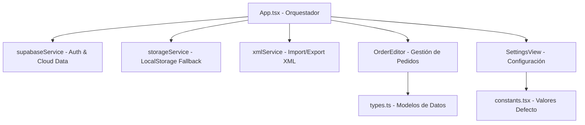

# Arquitectura Técnica - BRIIK Gestión de Pedidos

Este documento describe la arquitectura, el flujo de datos y los componentes técnicos del proyecto BRIIK Gestión de Pedidos.

## 🛠️ Stack Tecnológico
- **Framework**: React 19
- **Build Tool**: Vite
- **Lenguaje**: TypeScript
- **Backend / Auth**: Supabase
- **Estilos**: Tailwind CSS (clases utilitarias en componentes)
- **Persistencia**: Supabase (Cloud) + LocalStorage (Fallback/Legacy)
- **Intercambio de Datos**: XML Nativo

## 🏗️ Estructura del Proyecto

### 1. Núcleo de la Aplicación (`App.tsx`)
El componente `App` actúa como el **Single Source of Truth**. Gestiona la autenticación del usuario y tres estados principales de datos:
- `stores`: Listado de tiendas minoristas.
- `orders`: Listado global de pedidos vinculados a tiendas por `storeId`.
- `settings`: Configuración global (catálogo, modelos, colores, reglas de negocio).

### 2. Autenticación y Persistencia Cloud (`services/supabaseService.ts`)
La aplicación utiliza Supabase para:
- **Gestión de Sesiones**: Login mediante Magic Link (OTP).
- **Almacenamiento Seguro**: Los datos se guardan en tablas PostgreSQL con Row Level Security (RLS) para asegurar que cada usuario solo acceda a su información.

### 3. Persistencia Local (`services/storageService.ts`)
Mantenido como mecanismo de fallback y para compatibilidad previa.

### 4. Motor XML (`services/xmlService.ts`)
Implementación personalizada para exportar e importar datos sin dependencias externas:
- **Exportación**: Construcción manual de strings XML con plantillas literales.
- **Importación**: Uso de `DOMParser` para convertir archivos XML en objetos `AppData`. Soporta versionado (actualmente v1.1).

### 5. Reglas de Negocio (`constants.tsx` y `types.ts`)
El sistema está altamente parametrizado:
- **LineTypes**: Define si un producto requiere modelo, color o nombre personalizado.
- **Rules**: Controlan el MOQ (Mínimo de Pedido), costes de envío y tiempos de entrega.
- **Statuses**: Flujo de estados del pedido con colores asociados.

## 📊 Modelo de Datos (Esquema SQL en Supabase)
El esquema incluye tablas para `app_settings`, `stores`, `orders` y `order_lines`, con claves foráneas para mantener la integridad referencial y `user_id` para la segregación de datos.

## 🚀 Flujos Principales

### Autenticación
1. El usuario introduce su email.
2. Recibe un Magic Link.
3. Al entrar, se cargan automáticamente sus datos desde Supabase.

### Creación de Pedido
1. El usuario selecciona una tienda.
2. Se genera un número correlativo (`PED-XXXX`).
3. Se cargan las reglas de envío vigentes en `settings`.
4. Los cambios se sincronizan en tiempo real con la base de datos cloud.
